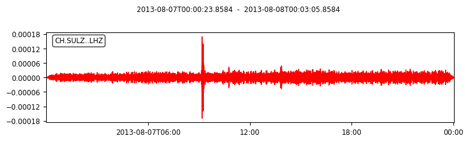

# How to join multiple SAC files to make one SAC file
In ambient noise tomography, we sometimes need to merge the signals of SAC files from different recorded times .
The following code shows the merged file of multiple SAC files.
A display of data for every single signal of SAC file: 

merged SAC file:

We would be happy if you could cite our paper for acknowledgement:

MM Sarvandani, E Kästle, L Boschi, S Leroy, M Cannat, Seismic Ambient Noise Imaging of a Quasi-Amagmatic Ultra-Slow Spreading Ridge,
Remote Sensing 13 (14), 2811
